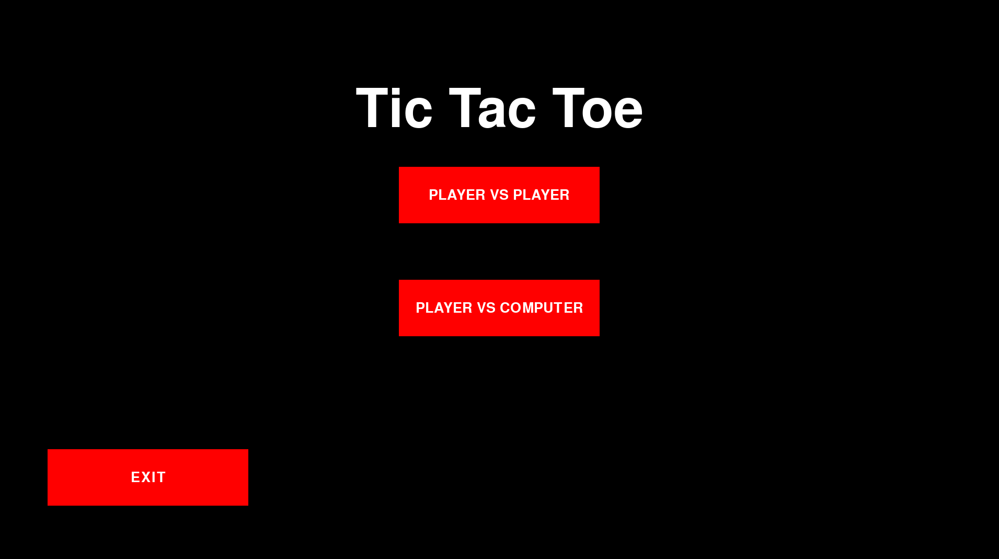
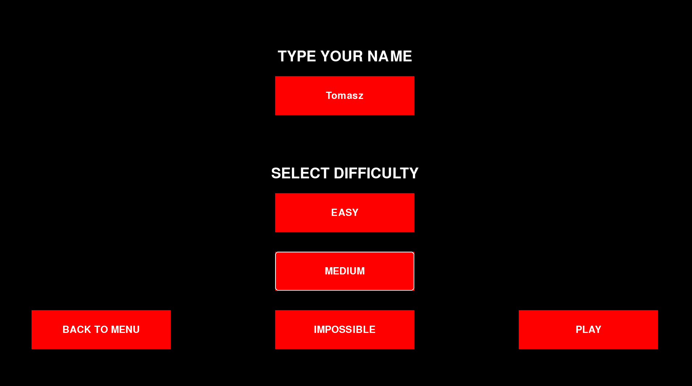
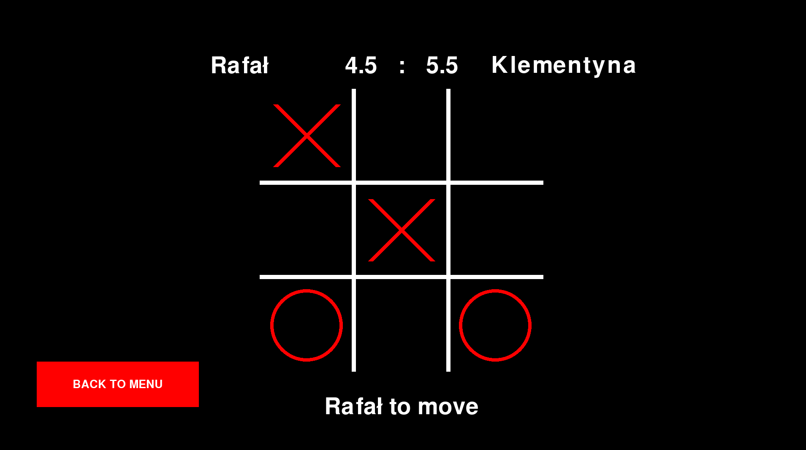
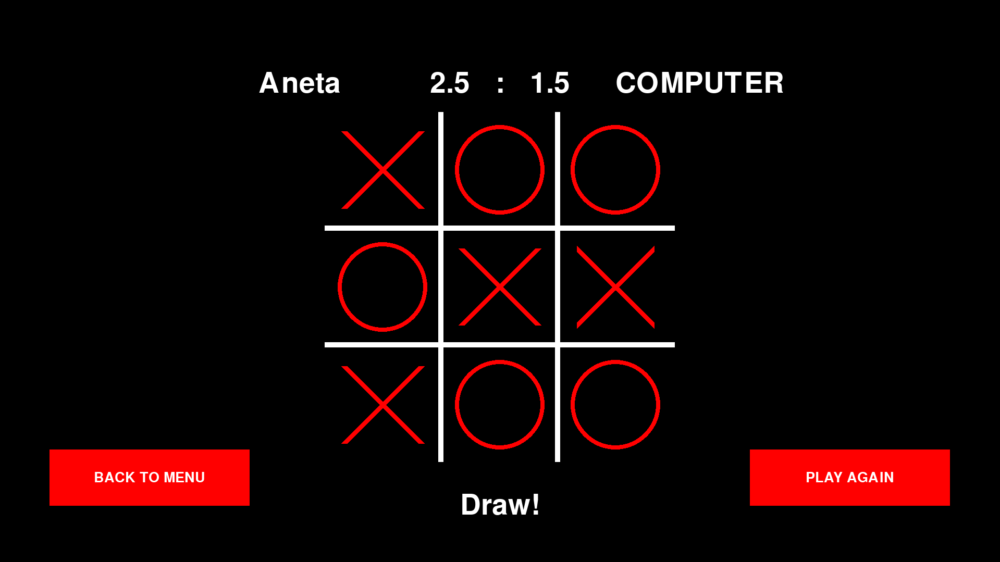

# Tic Tac Toe
---
Tic-Tac-Toe game written in pygame. Game allows to play in two modes:
1. Player vs Player
1. Player vs Computer

The computer has 3 difficulties to choose from:
1. Easy - computer makes random moves
2. Medium - computer defends against simple threats and wins the game if possible
3. Impossible - computer cannot be beaten 

You can also choose a name for each player.

You can make a move by clicking on the field you want to place an X or O.

After each round the bar above the game field changes the result. Then you can decide if you want to back to the main menu or ramatch.

